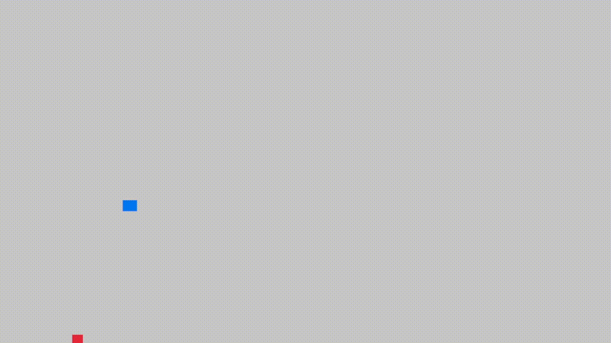

🎮 Basic Physic in Rust – Macroquad Demo

A minimalistic physics simulation written in Rust using Macroquad. This project demonstrates basic gravity, collision detection, and bouncing behavior between a moving object and a player-controlled block.


 Features

 Gravity simulation – The red square accelerates downward over time.

Collision detection – Axis-aligned bounding box (AABB) collisions with automatic position correction.

Bounce physics – Objects respond to collisions with a configurable bounce factor.

Platform control – Move the blue square using keyboard input (W, A, S, D).

 Reset functionality – Reset the red square to its initial position with R.


🛠️ Usage

Clone the repository:
```
git clone https://github.com/VojtaKing/Basic-Physic-in-Rust.git
cd Basic-Physic-in-Rust
```
Run the project:
```
cargo run
```

Controls:

Key	Action
W	Move blue square up
A	Move blue square left
S	Move blue square down
D	Move blue square right
R	Reset red square position
🧠 How it Works

collide_and_fix: Resolves collisions between two rectangles by adjusting positions to prevent overlap and updating velocities.

Main loop: Updates object positions, applies gravity, handles input, detects collisions, and renders frames.

📦 Dependencies

Rust 1.70+

Macroquad – Simple game framework for Rust
